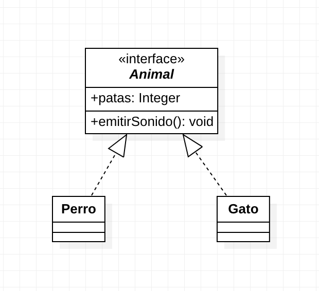

# Programación Orientada a objetos

## Atributos
- **-privados:** Son atributos que solo pueden ser accedidos dentro de la clase
- **+publicos:** Atributos que pueden ser accedidos desde fuera de la clase
- **#protegidos:** Solo pueden ser accedidos desde la propia clase y sus hijos

## Getters Setters
Los métodos que permiten acceder al valor de un atributo se denominan "getters" (del verbo inglés "get", obtener) y los que fijan el valor de un atributo se denominan "setters" (del verbo inglés "set", fijar).

Ejemplo:

```dart
class Cuadrado{
  
  double _lado;

  set lado(double valor){
    if (valor <= 0 ){
      throw('El lado no puede ser menor o igual a 0');
    }
    _lado = valor;
  }

  double get area{
    return _lado * _lado;
  }
}
```

## Clases abstractas

Las clases abstractas son aquellas que por sí mismas no se pueden identificar con algo 'concreto' (no existen como tal en el mundo real), pero sí poseen determinadas características que son comunes en otras clases que pueden ser creadas a partir de ellas.

Para que lo comprendas mejor, un ejemplo de clase abstracta sería una llamada Vehículo: todos ellos realizan acciones similares (arrancar, acelerar, frenar, etc.), pero sin embargo existen muchos tipos de vehículos diferentes y que se comportan de forma totalmente distinta (el proceso de arrancarlos no se realiza siguiendo los mismos pasos, unos tienen que despegar y vuelan como los aviones, otros se sumergen para desplazarse por debajo del agua como los submarinos, cada uno de ellos necesita ser frenado de distinto modo...).

Es decir, en el mundo real no existe un objeto 'vehículo' como tal sino que hay diferentes tipos de vehículo, pero aunque poseen características comunes y realizan las mismas acciones lo hacen de forma muy diferente (pudiendo además realizar otras específicas cada uno de ellos).

Así pues, ya que una clase abstracta no representa algo concreto tampoco puede ser instanciada (**no se puede crear un Objeto a partir de ella**) pero sí es posible crear otras clases en base a su definición.

> **NOTA:** Una clase abstracta obliga a otras clases a que implementen metodos y propiedades
> No incluye implementación

```dart


void main(){

}

abstract class Animal {
  int patas;
  void emitirSonido();
}

class Perro implements Animal {
  int patas;

  void emitirSonido(){
    print('GUAUUUU!!');
  }

}

class Gato implements Animal {
  int patas;

  void emitirSolindo(){
    print('MIAUUU!!');
  }
}
```

### Diagrama de clases


